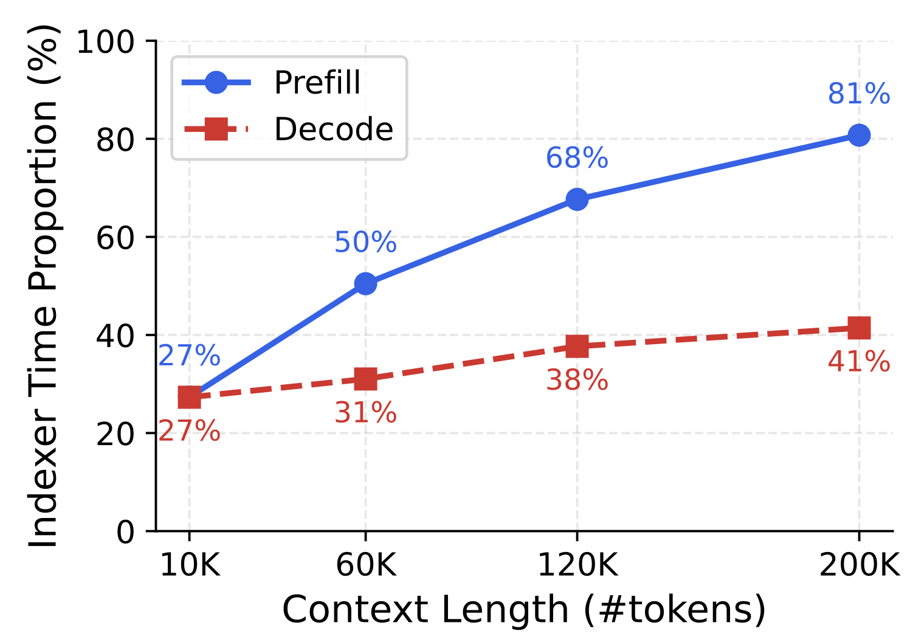
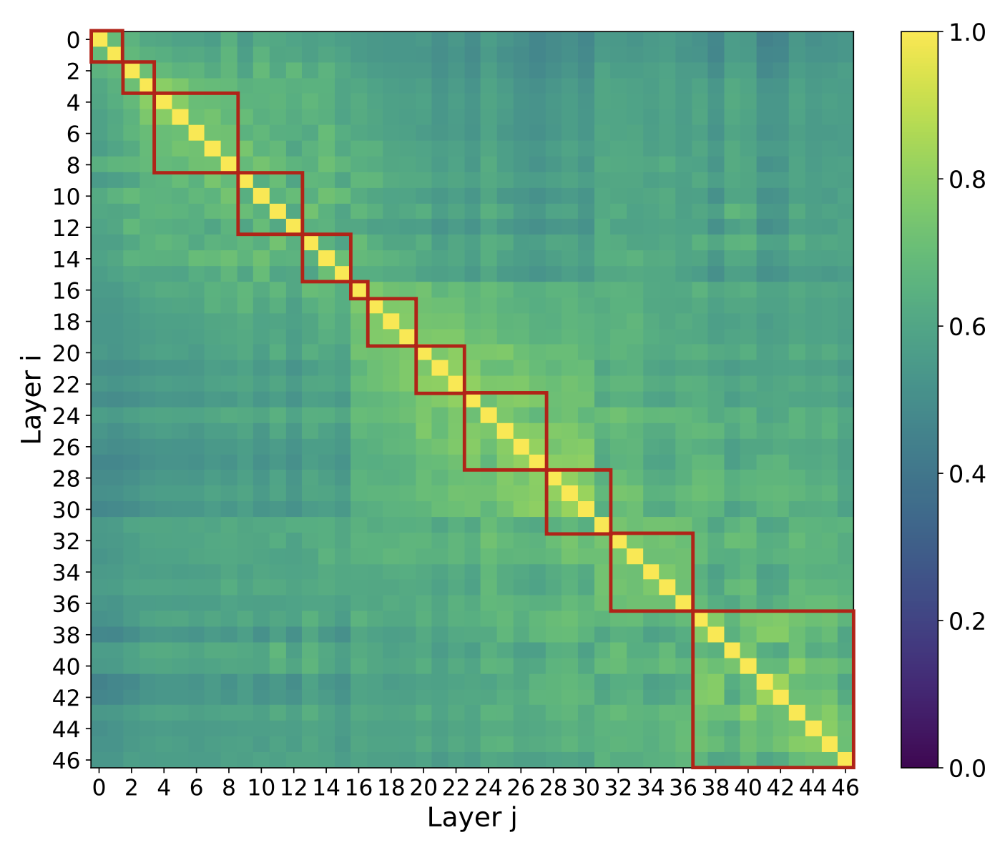
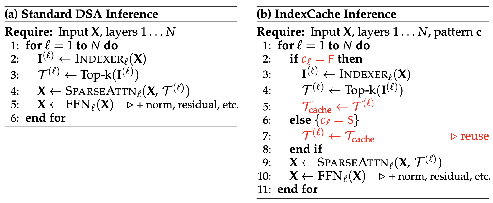
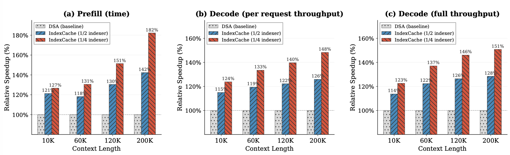
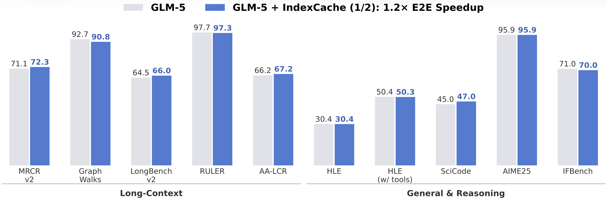

<div align="center">

# IndexCache

### Accelerating Sparse Attention via Cross-Layer Index Reuse

[](https://arxiv.org/abs/2603.12201)
[](LICENSE)
[](https://github.com/sgl-project/sglang)

**Yushi Bai, Qian Dong, Ting Jiang, Xin Lv, Zhengxiao Du, Aohan Zeng, Jie Tang, Juanzi Li**

*Tsinghua University & Z.ai*

</div>

---

This repository provides a patch for [SGLang](https://github.com/sgl-project/sglang) that enables **IndexCache** inference acceleration for models using DeepSeek Sparse Attention (DSA), including **DeepSeek-V3.2** and **GLM-5**.

> **TL;DR:** IndexCache eliminates up to 75% of indexer computations in DSA through cross-layer index reuse — achieving up to **1.82× prefill speedup** and **1.48× decode speedup** with negligible quality degradation. One `if/else` branch, zero extra GPU memory.

## 🔍 Motivation

In DSA, the *lightning indexer* selects the top-k most relevant tokens at each layer to make attention sparse. While cheap per-FLOP, it runs independently at **every** layer with O(L²) complexity. At long context lengths, it becomes the dominant bottleneck:

<p align="center">
  
  <br>
  <em>At 200K context, the indexer consumes <strong>81%</strong> of prefill time.</em>
</p>

## 💡 Key Insight

We measured pairwise top-k index overlap across all 47 DSA layers and found that **adjacent layers share 70–100% of their selected tokens**:

<p align="center">
  
  <br>
  <em>Cross-layer top-k overlap heatmap. Most indexer computations are redundant.</em>
</p>

## ⚙️ Method

IndexCache partitions layers into **Full** (F) layers that retain their indexer and **Shared** (S) layers that reuse the nearest F layer's cached indices:

<p align="center">
  
</p>

We propose two complementary approaches:

| Approach | Description | Requires Training? |
|----------|-------------|:---:|
| **Training-free** | Greedy search selects which indexers to remove based on LM loss on a calibration set | ✗ |
| **Training-aware** | Multi-layer distillation trains each retained indexer to serve all layers it covers | ✓ |

Both retain only **1/4 of indexers** with negligible quality degradation.

## 📊 Results

### 30B DSA Model — Speedup (H100)

<p align="center">
  
</p>

| | Baseline | IndexCache (1/4) | Speedup |
|:--|:--:|:--:|:--:|
| **Prefill** (200K) | 19.5s | 10.7s | **1.82×** |
| **Decode** (200K) | 58 tok/s | 86 tok/s | **1.48×** |

9 benchmarks virtually unchanged ✅

### GLM-5 (744B) — Production Validation

<p align="center">
  
</p>

**~1.2× E2E speedup** with negligible degradation across 10 benchmarks (long-context + reasoning).

---

## 🚀 Quick Start

### Step 1: Clone SGLang

```bash
git clone https://github.com/sgl-project/sglang.git
cd sglang
git checkout b638b25b
```

> This patch is built and tested against commit [`b638b25b`](https://github.com/sgl-project/sglang/commit/b638b25b). It may apply cleanly to newer versions, but if you encounter conflicts, use this specific commit.

### Step 2: Apply the patch

```bash
git apply /path/to/indexcache.patch
```

### Step 3: Launch with IndexCache

Configure via `--json-model-override-args`. Two options:

#### Option A — Uniform interleaving

Every N-th layer keeps its indexer:

```bash
python -m sglang.launch_server \
    --model-path zai-org/GLM-5-FP8 \
    --json-model-override-args '{"index_topk_freq": 2}' \
    ...  # your other args (tp, dp, etc.)
```

`index_topk_freq=2` → every 2th layer is Full, rest are Shared (50% indexers removed).

#### Option B — Custom pattern (from greedy search)

Specify per-layer F/S assignment:

```bash
python -m sglang.launch_server \
    --model-path zai-org/GLM-5-FP8 \
    --json-model-override-args '{"index_topk_pattern": "FFSFSSSFSSFFFSSSFFFSFSSSSSSFFSFFSFFSSFFFFFFSFFFFFSFFSSSSSSFSFFFSFSSSFSFFSFFSSS"}' \
    ...  # your other args
```

Each character maps to one DSA layer: `F` = Full (runs indexer), `S` = Shared (reuses cached indices).

> **Default behavior:** When neither parameter is set, all layers run their indexer — identical to standard DSA.

### Configuration Reference

| Parameter | Type | Default | Description |
|:--|:--:|:--:|:--|
| `index_topk_freq` | int | `1` | Keep indexer every N layers. `1` = disabled, `4` = keep 1/4 |
| `index_topk_pattern` | string | `null` | Per-layer F/S pattern. Overrides `index_topk_freq` if set |

**Which to use?**
- **`index_topk_freq: 4`** — Simple, good default. Best with training-aware models.
- **Custom pattern** — Optimal for training-free deployment. The example above is the greedy-searched pattern for the GLM-5 model.

---

## ✅ Supported Models

| Model | Architecture | Supported |
|:--|:--|:--:|
| DeepSeek-V3.2 | `DeepseekV32ForCausalLM` | ✅ |
| GLM-5 (744B) | `GlmMoeDsaForCausalLM` | ✅ |

Any model using DSA indexer through SGLang's `DeepseekV2AttentionMLA` benefits from this patch.

---

## 📝 Citation

```bibtex
@article{bai2025indexcache,
  title={IndexCache: Accelerating Sparse Attention via Cross-Layer Index Reuse},
  author={Bai, Yushi and Dong, Qian and Jiang, Ting and Lv, Xin and Du, Zhengxiao and Zeng, Aohan and Tang, Jie and Li, Juanzi},
  journal={arXiv preprint arXiv:2603.12201},
  year={2025}
}
```

## License

This patch is released under the [Apache 2.0 License](LICENSE), consistent with SGLang.
